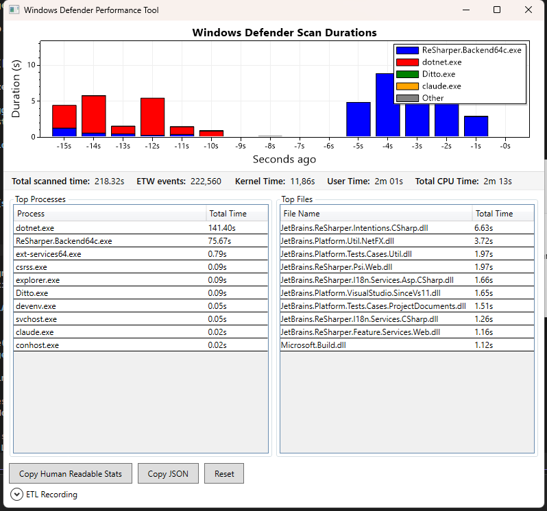
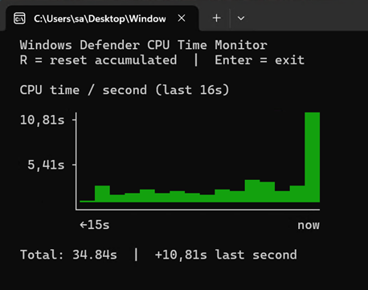

# Windows Defender Performance Tool

A .NET application that monitors Windows Defender ETW events and visualizes
scan durations in real-time using a stacked bar chart. Can also visualize
snapshots recorded offline with the
[`New-MpPerformanceRecording`](https://learn.microsoft.com/en-us/powershell/module/defenderperformance/new-mpperformancerecording?view=windowsserver2025-ps)
PowerShell cmdlet.

## Features

- Listens to `Microsoft-Antimalware-Engine/StreamScanRequestTask/Stop` ETW events
- Displays scan durations per process in a stacked bar chart
- Drag and drop files or folders onto the window to trigger an immediate scan of the dropped items
- CSV export when more than one snapshot is dragged to the window

## Lightweight CPU-time TUI

A companion console program (`WindowsDefenderPerformanceTool_Light_CpuTimeOnly_TUI`) tracks only CPU time consumed by
`MsMpEng.exe` and renders a small bar chart of recent activity. It does **not** require elevation — CPU times are read
via `NtQuerySystemInformation`, which is available to non-admin users.

## About scan duration

Windows Defender emits ETW start and stop events per scan operation. The durations shown are therefore wall-clock time,
not CPU time - if the OS scheduler preempts the Defender thread in between, the reported duration will exceed the actual
CPU time consumed.

## License

MIT

<!-- vim: set tw=120: -->
